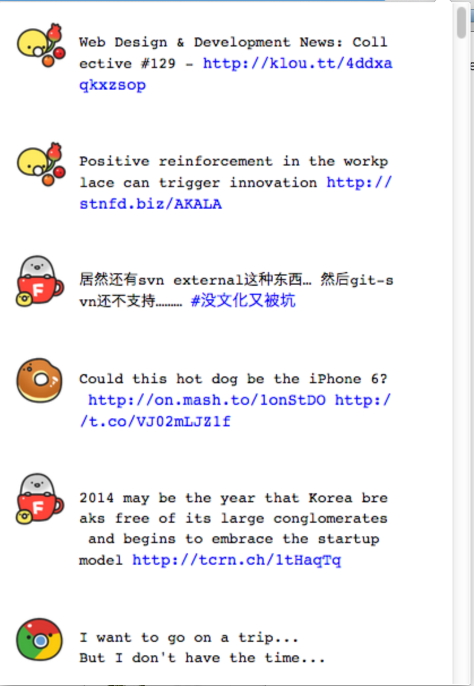

Open Secrets: It's a chrome extension. It uses twitter API to fetch one's timeline. But the avatar of the users are random pictures.
This project folked from https://github.com/kinjouj/chrome-extension-twitter-oauth-demo.

Logo: 

View:

